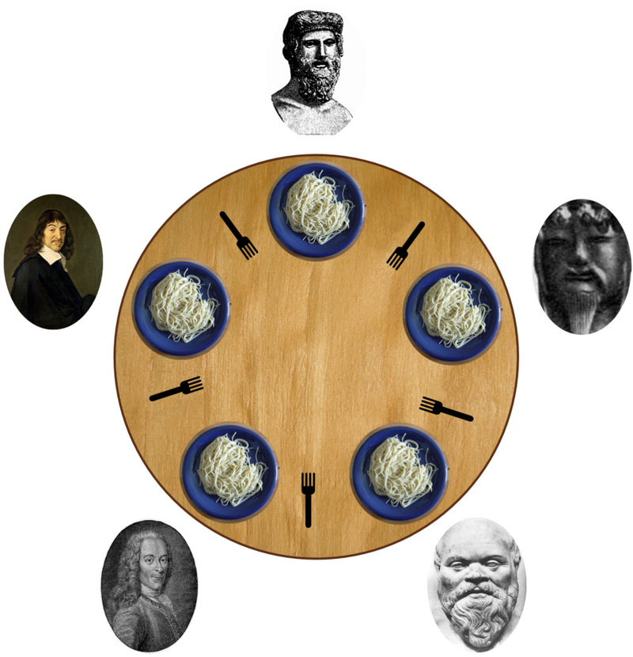

# Philosopers - 42 Project
Philosophers is a 42 school project designed around Edsger Dijkstra's famous dining philosophers problem. 



## The Problem
From [wikipedia](https://en.wikipedia.org/wiki/Dining_philosophers_problem): The problem was designed to illustrate the challenges of avoiding deadlock, a system state in which no progress is possible. To see that a proper solution to this problem is not obvious, consider a proposal in which each philosopher is instructed to behave as follows:

- think unless the left fork is available; when it is, pick it up;
- think unless the right fork is available; when it is, pick it up;
- when both forks are held, eat for a fixed amount of time;
- put the left fork down;
- put the right fork down;
- repeat from the beginning.

However, each philosopher will think for an undetermined amount of time and may end up holding a left fork thinking, staring at the right side of the plate, unable to eat because there is no right fork, until he starves. 

## Build Instructions
```
git clone https://github.com/vockers/philosophers.git
cd philosophers/philo
make
./philo	<number_of_philosophers> <time_to_die> <time_to_eat> <time_to_sleep> [number_of_times_each_philosopher_must_eat]
```